# Авторизация и Регистрация

#### Базово страница авторизации представляет из себя два поля для ввода почты и пароля и две кнопки для продолжения и перехода к странице регистрации.

#### При нажатии на кнопку "Регистрация" осуществляется переход на страницу регистрации. Она представляет из себя 3 поля для ввода, кнопку "Продолжить" и две кнопки "Показать", которые отвечают за отключения скрытия данных, введенных в поля "пароль".

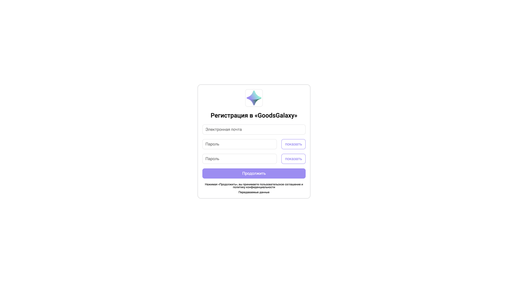

#### Также при вводе данных осуществляется валидация, но не в реальном времени, а после нажатия на кнопку "Продолжить".

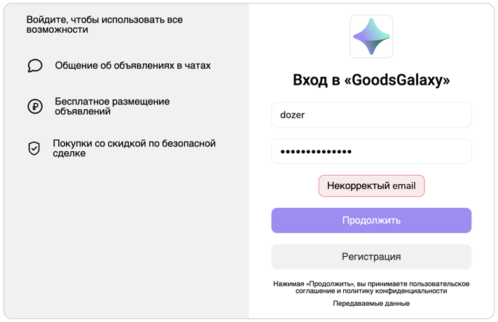

## Баги страниц авторизации и регистрации

#### Есть надпись о подтверджении пользовательского соглащения, но возможности с ним ознакомиться не представлено.

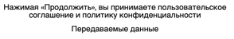

#### При бесконечном вводе с клавиатуры в поля ввода страница зависает и ломается.
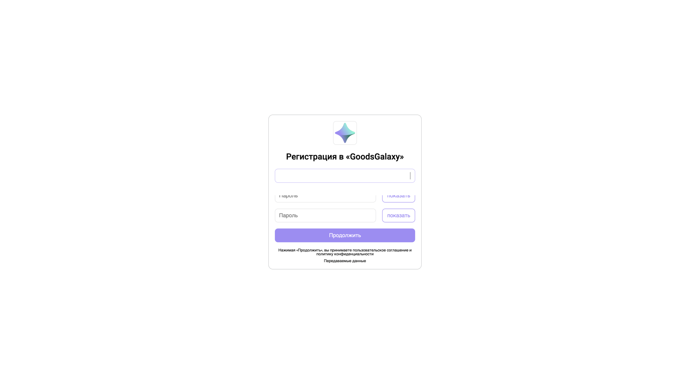
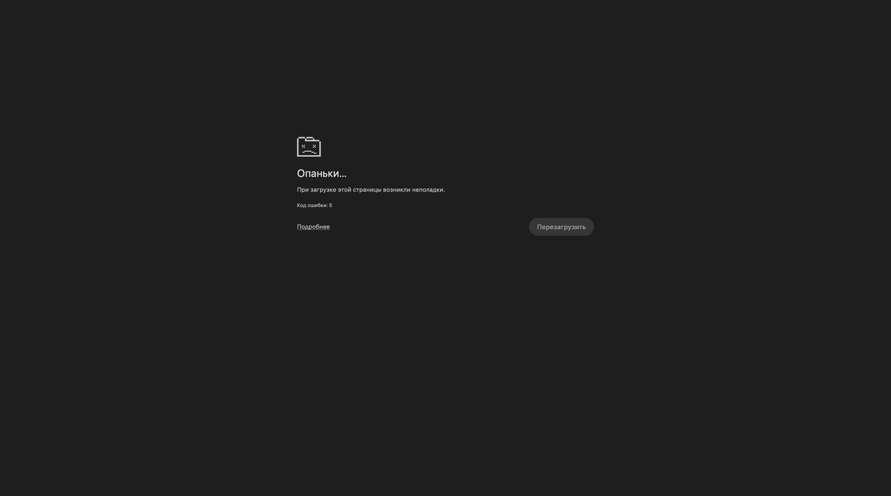

#### Перезагрузка страницы возвращает к исходному состоянию.

#### Есть ограничения по длине пароля, но пользователю оно отображается некорректно

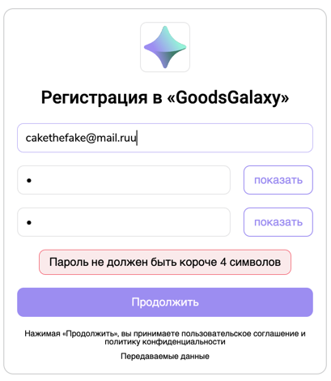

#### Нет возможности вставить пароль обычной вставкой, при нажатия комбинации клавиш ctrl + V ничего не происходит

#### Отсутствует верстка под мобильные устройства.

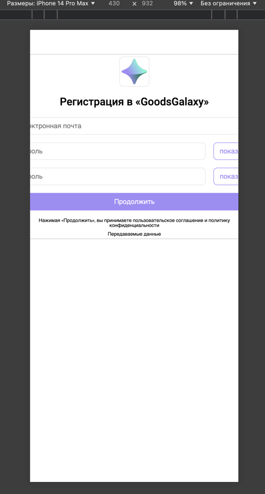

#### Так же удалось добиться возможности просмотра профиля, уже после выхода из аккаунта.

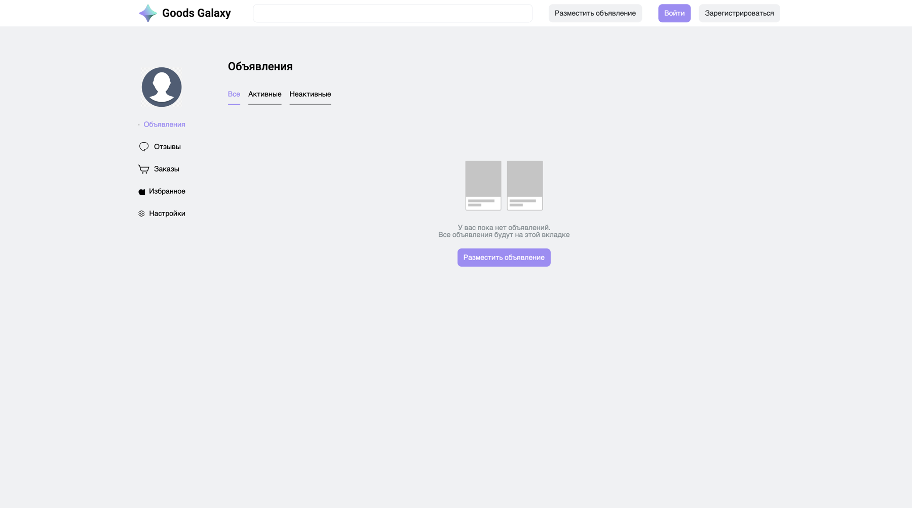

# Избранное

#### Страница "избранное" представляет раздел в профиле, в котором можно увидеть объявления, отмеченные пользователем.

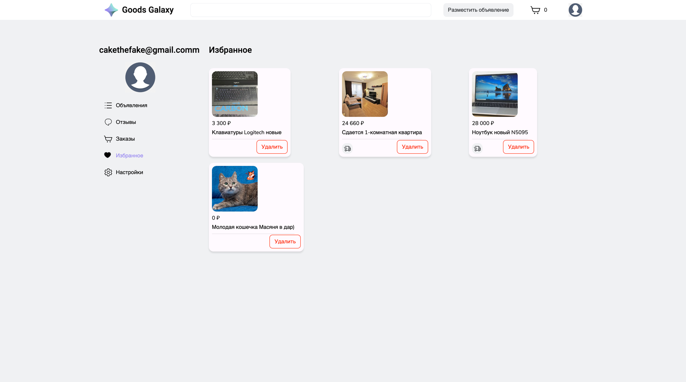

## Избранные баги

#### При слишком длинном названии съезжает верстка.

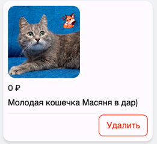

#### Слишком расстояние между объявлениями почти равно ширине самого объявления.

#### Если на странице изранного нажать "назад", то селектор слева не переключается обратно.

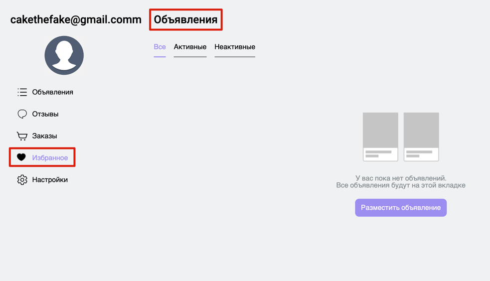

#### Верстка не адаптируется под длину названия.

#### Съезжает фон.

