## Страница объявления

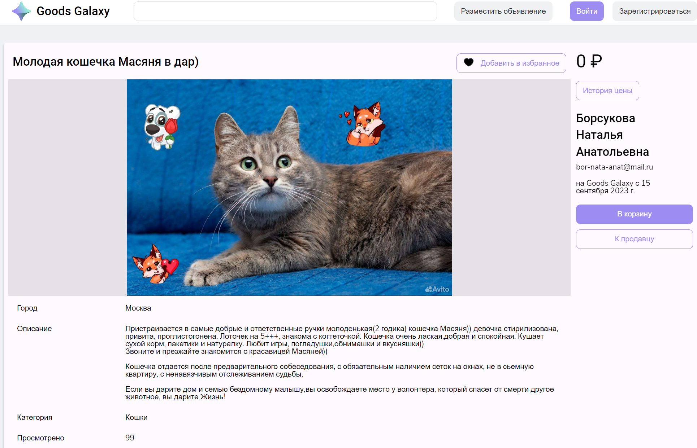

**На странице отображаются:**
   * Данные о товаре (Название, фото, город, описание, категория, цена и кол-во просмотров)
   * Данные о продавце (имя, почта и дата публикации объявления)
   * История цен
   * Кнопка добавления товара в корзину

### История цены
При нажатии на кнопку "история цены" появляется всплывающее окно с графиком

### Избранное
Корректное отображение добавления в избранное авторизованным пользователем

### Баги страницы объявления
* Некорректное отображение истории цен

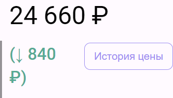

* При попытке добавить товар в корзину без авторизации было бы целесообразнее сообщать, что требуется авторизация, или сразу перенаправлять пользователя на страницу авторизации

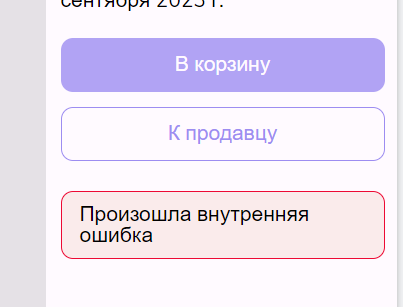
# Авторизация и Регистрация

#### Базово страница авторизации представляет из себя два поля для ввода почты и пароля и две кнопки для продолжения и перехода к странице регистрации.
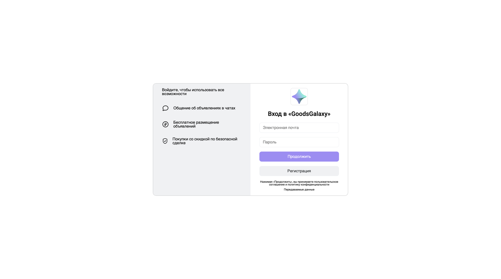

#### При нажатии на кнопку "Регистрация" осуществляется переход на страницу регистрации. Она представляет из себя 3 поля для ввода, кнопку "Продолжить" и две кнопки "Показать", которые отвечают за отключения скрытия данных, введенных в поля "пароль".

#### Также при вводе данных осуществляется валидация, но не в реальном времени, а после нажатия на кнопку "Продолжить".

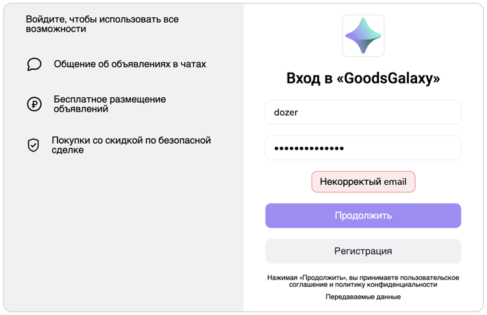

#### При нажатии на лого осуществляется переход на главную страницу.

#### При нажатии на кнопку "продолжить" осуществляется вход либо регистрация.

## Баги страниц авторизации и регистрации

#### Есть надпись о подтверджении пользовательского соглащения, но возможности с ним ознакомиться не представлено.

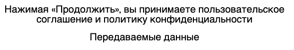

#### При бесконечном вводе с клавиатуры в поля ввода страница зависает и ломается.

#### Перезагрузка страницы возвращает к исходному состоянию.

#### Есть ограничения по длине пароля, но пользователю оно отображается некорректно

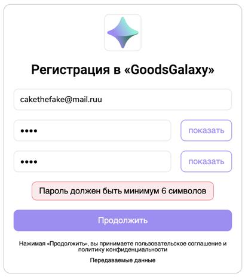

#### Нет возможности вставить пароль обычной вставкой, при нажатия комбинации клавиш ctrl + V ничего не происходит

#### Отсутствует верстка под мобильные устройства.

#### Так же удалось добиться возможности просмотра профиля, уже после выхода из аккаунта.

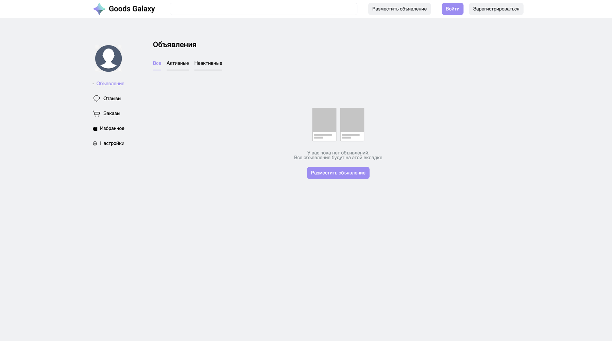

# Избранное

#### Страница "избранное" представляет раздел в профиле, в котором можно увидеть объявления, отмеченные пользователем.

#### При нажатие кнопки удалить, объявления удаляется из избранного.

#### При нажатии на объявление в избранном открывается страница объявления.

## Избранные баги

#### При слишком длинном названии съезжает верстка.

* При попытке добавить товар в избранное без авторизации не возникает никаких ошибок или предупреждений со стороны интерфейса

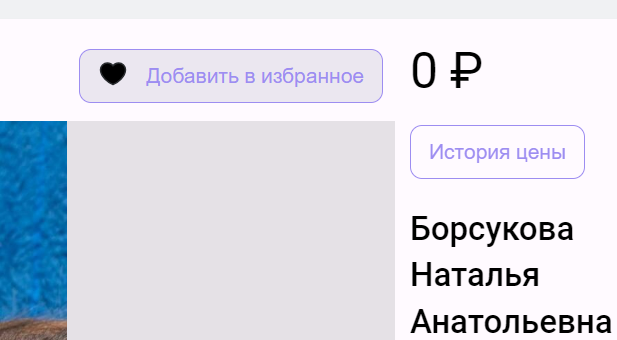

* Имеется возможность в поля с названием и описанием добавить zalgo текст

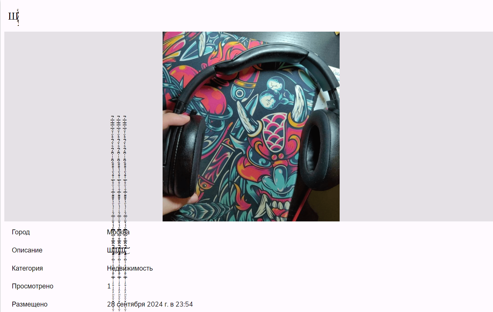

* Не юзер френдли сообщение об ошибке

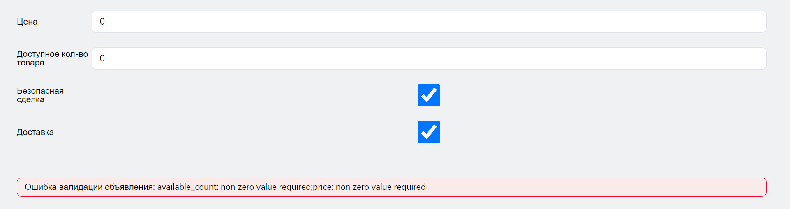

## Страница настроек пользователя

1. **На странице отображаются:**
   * Поле вставки изображения для аватара
   * Поле ввода имени
   * Поле ввода телефона
   * Поле ввода почты
   * Кнопки сохранить и отменить изменения
   
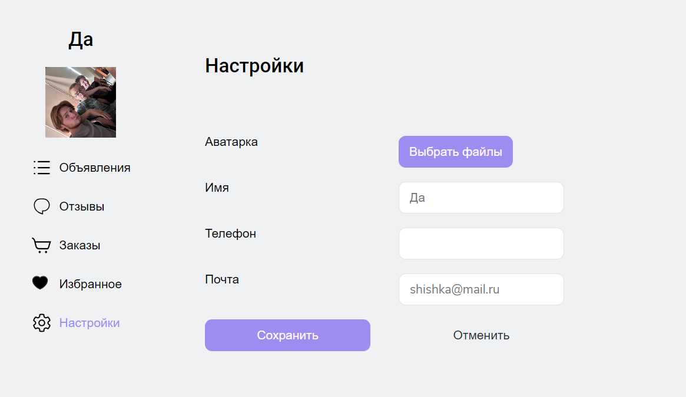

### Баги страницы настроек
* При попытке загрузить слишком большой файл не возникает никаких ошибок или предупреждений со стороны интерфейса

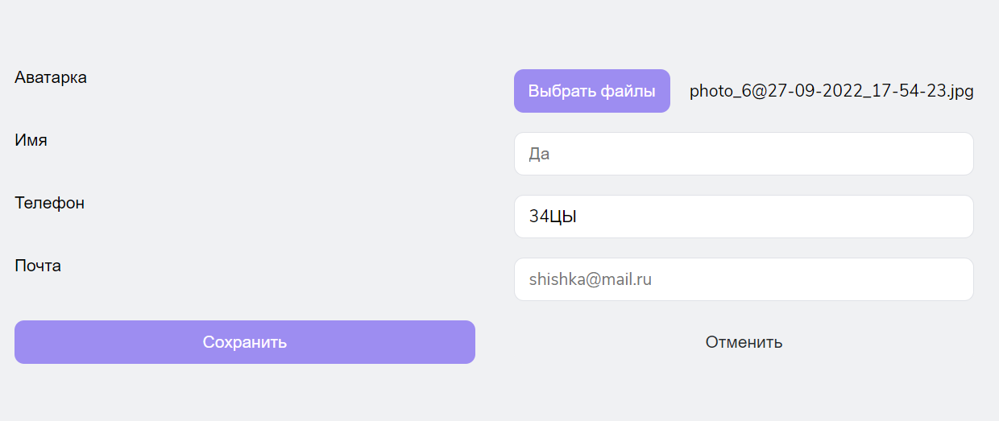

* Нет никакой валидации

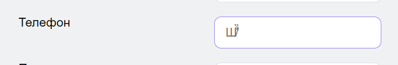

* при вводе новой почты данные записываются в номер телефона (+ отсутствует валидация)

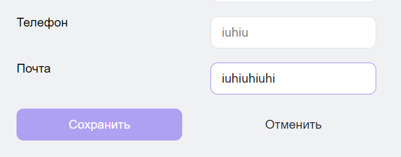

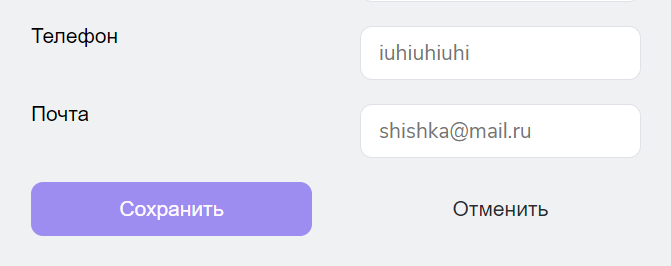
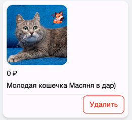

#### Расстояние между объявлениями почти равно ширине самого объявления.

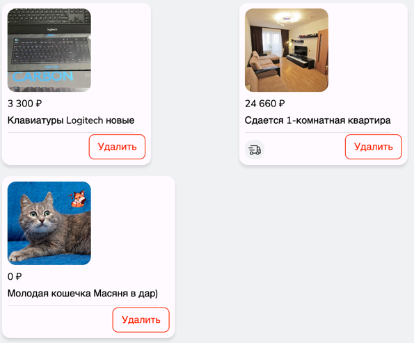

#### Если на странице изранного нажать "назад", то селектор слева не переключается обратно.

#### Верстка не адаптируется под длину названия.

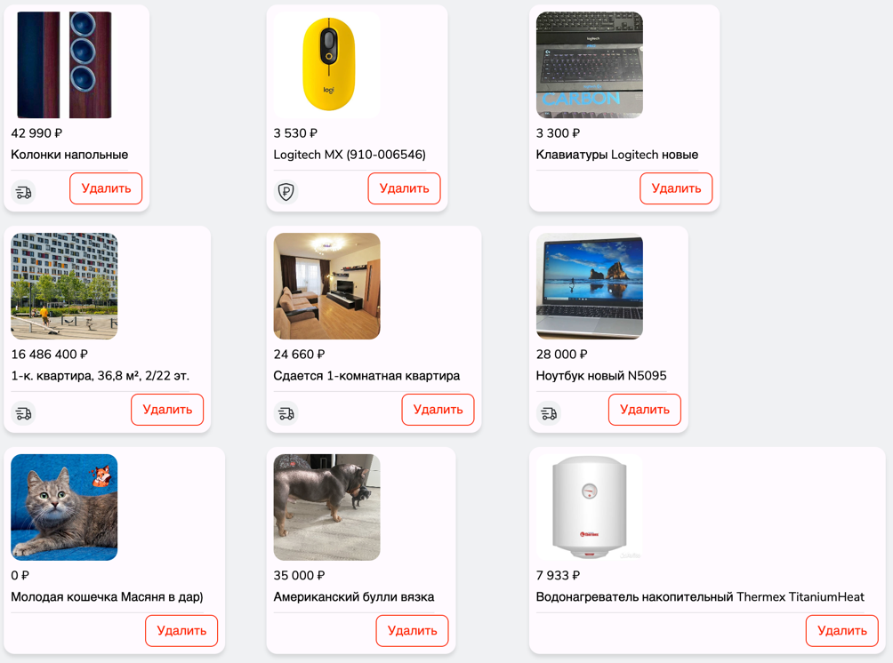

#### Съезжает фон.

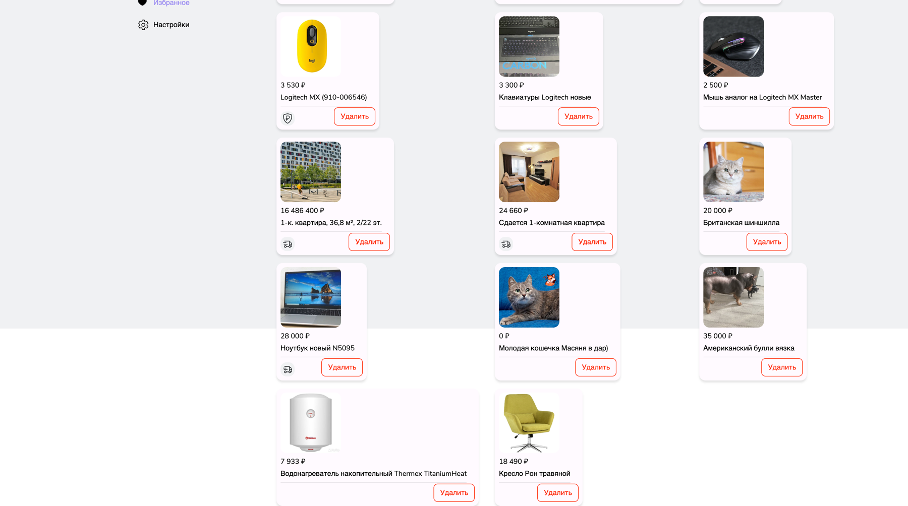