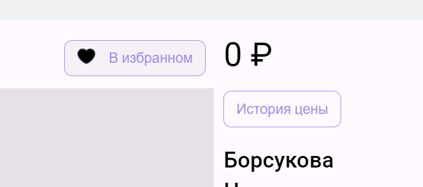

# ДЗ 1
- Название команды: Нетраннеры
- Тестовое окружение: Google Chrome Версия 129.0.6668.90 (Официальная сборка), (64 бит)
- Ссылка на сайт: https://goods-galaxy.ru/ 

## Страница объявления

**На странице отображаются:**
   * Данные о товаре (Название, фото, город, описание, категория, цена и кол-во просмотров)
   * Данные о продавце (имя, почта и дата публикации объявления)
   * История цен
   * Кнопка добавления товара в корзину
   * Кнопка перехода к профилю продавца

### История цены
* При нажатии на кнопку "история цены" появляется всплывающее окно с графиком

* Неправильная верстка истории цен

### Избранное
* При нажатии на кнопку Добавить в избранное авторизованным пользователем, текст кнопки меняется на "В избранном"

* При попытке добавить товар в избранное без авторизации не возникает никаких ошибок или предупреждений со стороны интерфейса

### Кнопка добавления товара в корзину

* При добавлении товара в корзину авторизованным пользователем меняется текст на "Данный товар уже в корзине"

* При попытке добавить товар в корзину без авторизации не возникает никаких ошибок или предупреждений со стороны интерфейса

### Создание объявления

* При заполнении всех полей создается страница товара

* Имеется возможность в поля с названием и описанием добавить zalgo текст

* При вводе 0 в поле "цена" и "доступное кол-во товара вылетает" не юзер френдли сообщение об ошибке

## Страница настроек пользователя

1. **На странице отображаются:**
   * Поле вставки изображения для аватара
   * Поле ввода имени
   * Поле ввода телефона
   * Поле ввода почты
   * Кнопки сохранить и отменить изменения
   

### Поле ввода имени

* При вводе нового имени и нажатии кнопки "Сохранить" сразу обновляется имя профиля

* Имеется возможность в поле Имя ввести zalgo текст

### Поле ввода телефона

* При вводе нового телефона и нажатии кнопки "Сохранить" сразу обновляется телефон

* Отсутствует валидации

### Поле ввода почты

* при вводе новой почты данные записываются в номер телефона (+ отсутствует валидация)

### Поле загрузки аватарки

* При попытке загрузить слишком большой файл не возникает никаких ошибок или предупреждений со стороны интерфейса

# Главная страница

#### На главной странице можно
- Просмотреть объявления
- Перейти к конкретному объявлению с помощью клика
- Проверить возможность доставки товара или наличие безопасной сделки
- Найти товар через поиск
- Перейти на страницу размещения товара
- Перейти на страницу входа в аккаунт
- Перейти на страницу регистрации
- Перейти на главную страницу сайта
- Перейти в профиль пользователя
- Перейти в корзину
- Выйти из профиля

*Все пункты кроме первых трех относятся к навбару и будут рассмотрены только в этом разделе

#### Просмотр объявлений
Товары на странице загружаются пачками. Изначально товаров на странице нет, потом загружаются первые 20 товаров, при скроле страницы до конца, прогружаются следующие 20 товаров

#### Переход к конкретному объявлению при помощи клика
При клике на значок товара, открывается его страница
#### Проверка дополнительных параметров
Около значков товаров присутствует отдельный элемент, сигнализирующий о дополнительных параметрах продажи. При наведении на такой значок всплывает подсказка, а при клике происходит переадресация на страницу товара

#### Поиск
В поиске пользовтель вводит свой запрос и сразу получает всплывающий список товаров, в названии которых присутствуют нужные буквы. При нажатии клавиши enter, товары на главной странице заменяются на те, которые удовлетворяют поисковому запросу.

#### Переход на страницу размещения товара
Если пользователь не авторизован, то происходит переадресация на страницу входа в аккаунт.

#### Переход на страницу входа в аккаунт
Данная функция доступна только для неавторизованных пользователей. При нажатии происходит переадресация на страницу входа в аккаунт

#### Переход на страницу регистрации
Данная функция доступна только для неавторизованных пользователей. При нажатии происходит переадресация на страницу регистрации

#### Переход на главную страницу сайта
При нажатии на логотип происходит переадресация на главную страницу сайта

#### Переход в профиль пользователя
При нажатии на профиль в всплывающем окне можно выбрать пункт "Профиль" и происходит переадресация на профиль пользователя

#### Переход в корзину
При нажатии на значок корзины происходит переадресация на страницу корзины. Доступно только авторизированным пользователям

#### Выход из профиля
При нажатии на профиль в всплывающем окне можно выбрать пункт "Выйти" тогда пользователь становится неавторизованным. Доступно только авторизированным пользователям

## Баги главной страницы

#### Не у всех товаров с плашкой "возможна доставка" доставка возможна

#### Во время поиска при клике на конкретный товар в всплывающем списке не происходит переадресация на конкретный товар, а отображается страница с таким запросом поисковым запросом.

#### Всплывающий список невозможно убрать с экрана без изменения запроса в поисковой строке

#### Если быстро написать запрос в строку поиска и отправить его, то выведется последний удачный поисковой запрос (или главная страница сайта)

#### Если поисковый запрос не имеет совпадений, то будет выведен последний удачный поисковый запрос

_*Комментарий к двум предыдущим пунктам: То есть если поисковый запрос не успел отработать, то выводится последний удачный_

# Корзина пользователя

#### В корзине можно
- Просмотреть список товаров
- Перейти на главную страницу (если товары отсутсвуют в корзине)
- Перейти на страницу товара с помощью клика по товару
- Изменить количество товаров в корзине
- Удалить позицию из корзины
- Оформить заказ
- Видеть кол-во товаров в корзине и их стоимость

#### Просмотр списка товаров
В корзине отображаются товары, которые пользователь положил в корзину. Товары имеют кол-во, стоимость, описание и имя продавца

#### Переход на главную страницу
При нажатии на кнопку перейти на главную страницу происходит переадресация на главную страницу сайта

#### Переход на страницу товара с помощью клика по картинке товара
При нажатии на картинку товара происходит переадресация на страницу данного товара

#### Изменение кол-ва товаров в корзине
Если возможно, то у товара будут доступны кнопки "-" и "+", при нажатии на которые изменяется кол-во единиц данного товара в заказе

#### Удаление позициии из корзины
При нажатии на значок мусорки, то происходит полное удаление товара из корзины, независящее от количества единиц товара

#### Оформление заказа
При нажатии кнопки "Оформить заказ", все товары пропадают из корзины и становятся недоступными для покупки. Так же товары перемещаются во вкладку "Заказы" данного пользователя

#### Кол-во товаров в корзине и их стоимость
При наличии товаров в корзине, около значка корзины будет гореть кол-во товаров
Внутри корзины так же можно увидеть кол-во товаров и их общую стоимость

## Баги корзины пользователя

#### При слишком длинном названии, позиция и размер кнопок, отвечающих за кол-во товара, меняются

#### При наведении на картинку товара, курсор остается неизменным, хотя пользователь может перейти на товар с помощью клика

#### При количестве товаров, превышающем 4, список товаров уходит за пределы фона страницы

# Страница продавца

#### На странице продавца можно
- Просмотреть список товаров от данного продавца
- Просмотреть отзывы к данному продавцу
- Просмотреть данные продавца
- Перейти к странице товара

#### Просмотр списка товаров продавца
На странице продавца отображаются все товары, которые он выставил

#### Просмотр отзывов к продавцу
При нажатии на кнопку "Отзывы" можно увидеть отзывы, которые пользователи отсавили к товарам, выложенным данным продавцом.

#### Просмотр данных пользователя
На странице продавца указывается его Аватар, Имя и Рейтинг

#### Переход к странице товара
При нажатии на карточку товара, происходит переадресация на страницу данного товара

## Баги страницы продавца

#### В зависимости от размера картинки/описания товара, различаются зазоры между соседними элементами

#### Если товаров больше девяти, то списко товаров будет выходить за нижнюю границу фона страницы

#### Если картника/описание товара или текст отзыва слишком широкое, то размер звездочек в рейтинге продавца уменьшается

#### Текст комментария уходит за границы комментария и не переностися на другую строку
(текстом были 950 символов А без пробелов)

# Авторизация и Регистрация

#### Базово страница авторизации представляет из себя два поля для ввода почты и пароля и две кнопки для продолжения и перехода к странице регистрации.

#### При нажатии на кнопку "Регистрация" осуществляется переход на страницу регистрации. Она представляет из себя 3 поля для ввода, кнопку "Продолжить" и две кнопки "Показать", которые отвечают за отключения скрытия данных, введенных в поля "пароль".

#### Также при вводе данных осуществляется валидация, но не в реальном времени, а после нажатия на кнопку "Продолжить".

#### При нажатии на лого осуществляется переход на главную страницу.

#### При нажатии на кнопку "продолжить" осуществляется вход либо регистрация.

## Баги страниц авторизации и регистрации

#### Есть надпись о подтверджении пользовательского соглащения, но возможности с ним ознакомиться не представлено.

#### При бесконечном вводе с клавиатуры в поля ввода страница зависает и ломается.

#### Перезагрузка страницы возвращает к исходному состоянию.

#### Есть ограничения по длине пароля, но пользователю оно отображается некорректно

#### Нет возможности вставить пароль обычной вставкой, при нажатия комбинации клавиш ctrl + V ничего не происходит

#### Отсутствует верстка под мобильные устройства.

#### Так же удалось добиться возможности просмотра профиля, уже после выхода из аккаунта.

# Избранное

#### Страница "избранное" представляет раздел в профиле, в котором можно увидеть объявления, отмеченные пользователем.

#### При нажатие кнопки удалить, объявления удаляется из избранного.

#### При нажатии на объявление в избранном открывается страница объявления.

## Избранные баги

#### При слишком длинном названии съезжает верстка.

#### Расстояние между объявлениями почти равно ширине самого объявления.

#### Если на странице изранного нажать "назад", то селектор слева не переключается обратно.

#### Верстка не адаптируется под длину названия.

#### Съезжает фон.

# Страница объявлений пользователя

## Что можно сделать

- просмотреть список всех объявлений
- просмотреть список активных объявлений
- просмотреть список неактивных объявлений
- удалить объявление
- активировать/деактивировать
- купить платное продвижение

## Баги

### Некорректное отображение всех товаров, активных и неактивных с длинным названием

### Некорректное отображение большого числа объявлений

### Нет подтверждения при удалении

Т.к. нет дополнительного окна, то легко случайно удалить объявление, что негативно сказывается на опыте пользователя

### Продвижение неактивных объявлений

Не понятно, зачем доступно платное продвижение неактивных объявлений

### При прокрутки пропадает header сайта

Если прокрутить вниз, то пропадает header с поиском, корзиной и профилем. Чтобы воспользоваться данными функциями, приходится возвращаться в самый верх сайта

# Страница заказов пользователя

## Что можно сделать

- просмотреть купленные товары
- просмотреть проданные товары

## Баги

### Некорректное отображение купленных и проданных товаров с длинным названием

### Некорректное отображение большого числа заказов и продаж

### При прокрутки пропадает header сайта

Если прокрутить вниз, то пропадает header с поиском, корзиной и профилем. Чтобы воспользоваться данными функциями, приходится возвращаться в самый верх сайта

